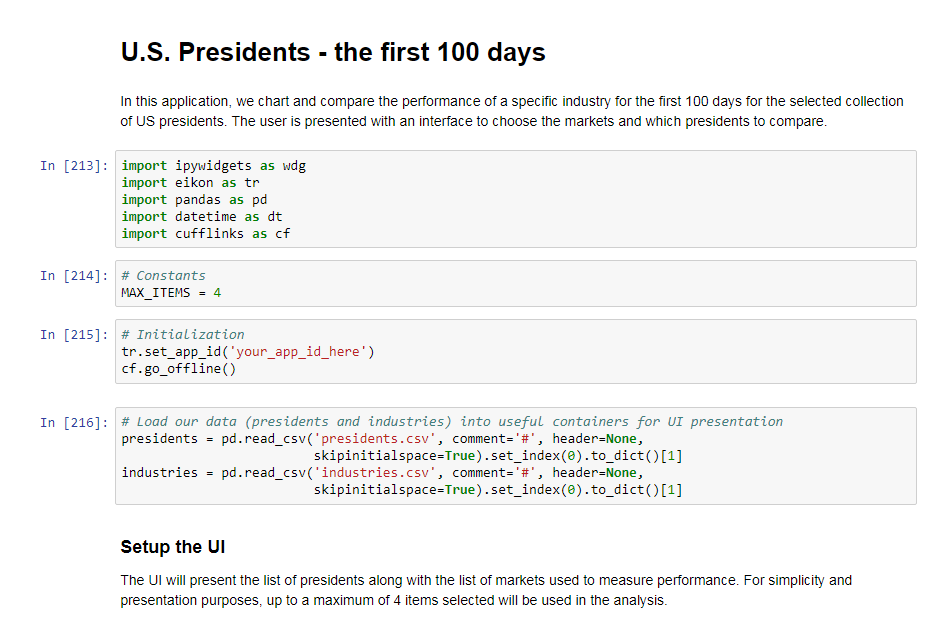

# U.S. Presidents - The first 100 Days


## Table of Content

* [Overview](#overview)

* [Disclaimer](#disclaimer)

* [Prerequisites](#prerequisites)

* [Setup](#setup)


## <a id="overview"></a>Overview
Coined in 1933, the **first 100 days** is sometimes used to measure the successes and accomplishments of a first-term president during the time that the their power and influences are at their greatest.  Approval rates are largely taken from polls and surveys where the results are typically measured based on their performance.  Criteria such as the decisions made, changes based on campaign promises, etc., are expected but also general perception, and overall popularity can be very influential. In addition to public opinion, how the financial markets respond during this time can be an interesting guide or measuring-stick when grading the first 100 days.  

Using the power of Python and the Thomson Reuters Eikon Scripting API, the following Jupyter notebook application provides a simple mechanism to create a number of "what-if" scenarios to measure the performances of presidents to see how the market has responded to the first 100 days.

Details and concepts are further explained in the [U.S. Presidents - The first 100 Days](https://developers.thomsonreuters.com/article/us-presidents-first-100-days) article published on the [Thomson Reuters Developer Community portal](https://developers.thomsonreuters.com).

## <a id="disclaimer"></a>Disclaimer
The source code presented in this project has been written by Thomson Reuters only for the purpose of illustrating the concepts of creating the "what-if" scenarios using Python and the Eikon Scripting API.  It has not been tested for a usage in production environments.

***Note:** To be able to ask questions and to benefit from the full content available on the [TR Developer Community portal](https://developers.thomsonreuters.com) we recommend you to [register here]( https://developers.thomsonreuters.com/iam/register) or [login here]( https://developers.thomsonreuters.com/iam/login?destination_path=Lw%3D%3D).*

## <a name="prerequisite"></a>Prerequisites

Software components used:

* [Eikon Web and Scripting API](https://developers.thomsonreuters.com/eikon-apis/eikon-web-and-scripting-apis) - Thomson Reuters interface to access Eikon data on the desktop
* [Python](https://www.python.org/downloads/release/python-361/) (3.6.1)- Python Development Environment - version 3
* [Jupyter notebooks](http://jupyter.org/) - Browser-based development environment to create equations, visualization and explanatory text.
* [ipywidgets](https://github.com/jupyter-widgets/ipywidgets) (7.0.0) - Interactive HTML widgets for jupyter notebooks
  * One time initialization:
    * **With pip**: jupyter nbextension enable --py --sys-prefix widgetsnbextension
    * **With conda**: conda install -c conda-forge ipywidgets 
* [Pandas](http://pandas.pydata.org/) (0.20.3) - Python Data Analysis Library
* [Cufflinks](https://plot.ly/ipython-notebooks/cufflinks/#cufflinks-reference) (0.12.0)  - Library that greatly simplifies [Plotly](https://plot.ly/feed/) charting  

## <a name="setup"></a>Setup

The application package includes the following:
* **USPresidents_100Days.ipynb**
  
  The Jupiter Notebook document represents the example containing the core Python instructions to execute our application.  All the input data is driven from simple text files allowing the user to easily add additional values.

* **presidents.csv**
  
  The presidents file is a collection of (`name,date`) pairs where the date value represents the inauguration date of their first term:
  ```text
  Donald J Trump, 2017-01-20
  Barack Obama, 2009-01-20 
  George W. Bush, 2001-01-20
  ```

* **industries.csv**

  The industries file contains a collection of (`name,ric`) pairs where the `ric` is the Reuters Instrument Code representing the market of interest:

  ```text
  Equity: Dow Jones, .DJI
  Equity: Mkt Volatility, .VIX
  Currency: USD $, =USD
  ```

## Running the application

The application is executed within the `Jupyter notebooks` web-based environment.  Prior to running the application, ensure you have launched your Eikon API Proxy - a component packaged with the Eikon Web and Scripting API bundle.
 
  To run the application, let's load up Notebook:

  ```text
  > cd <directory of the downloaded package>
  > jupyter notebook
  ```

Within your browser, load up the `USPresidents_100Days.ipynb` application:



Once loaded, you can start by stepping through the code segments to reach the point where the UI is presented for your input selection.

### <a id="contributing"></a>Contributing

Please read [CONTRIBUTING.md](https://gist.github.com/PurpleBooth/b24679402957c63ec426) for details on our code of conduct, and the process for submitting pull requests to us.

### <a id="authors"></a>Authors

* **Nick Zincone** - Release 1.0.  *Initial version*

### <a id="license"></a>License

This project is licensed under the MIT License - see the [LICENSE.md](LICENSE.md) file for details

