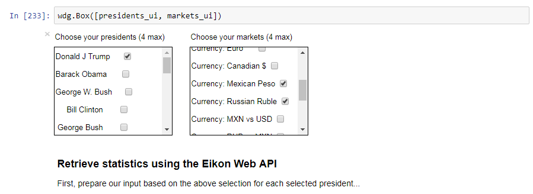
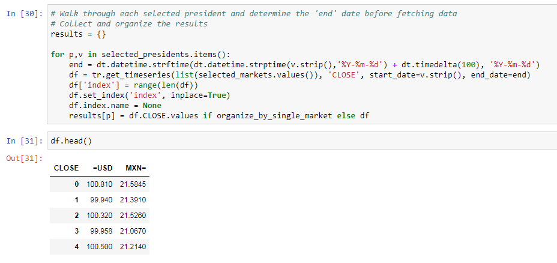
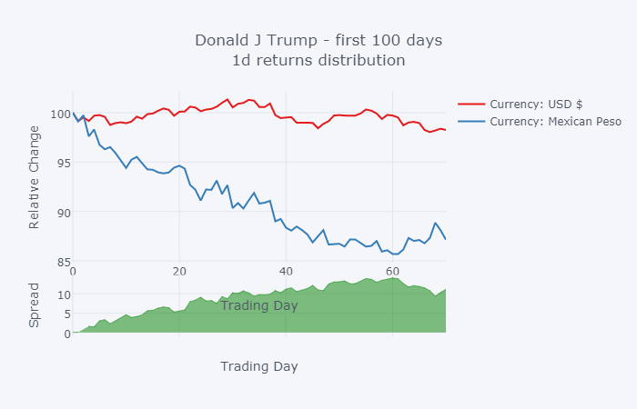
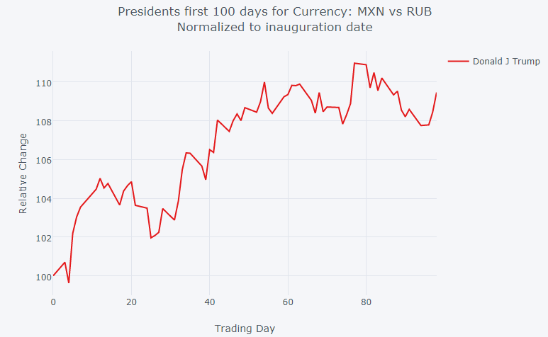
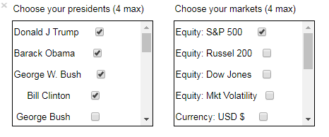
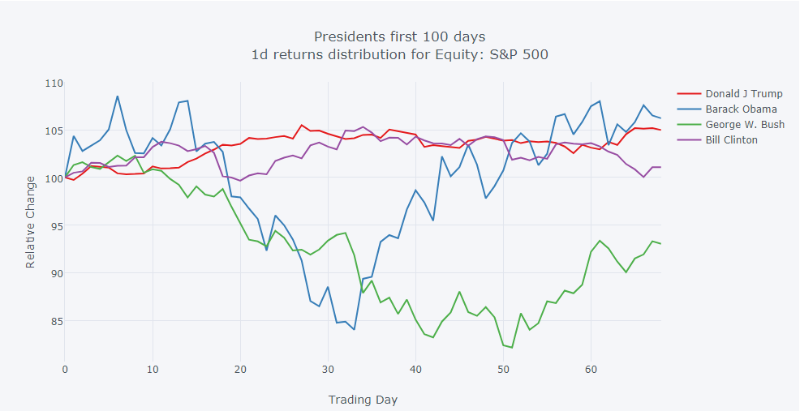
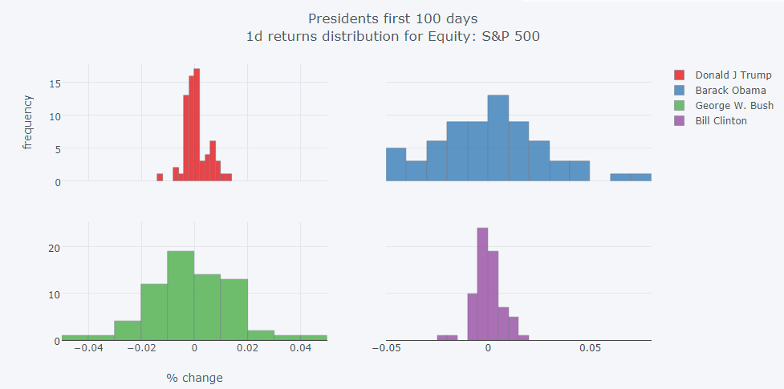
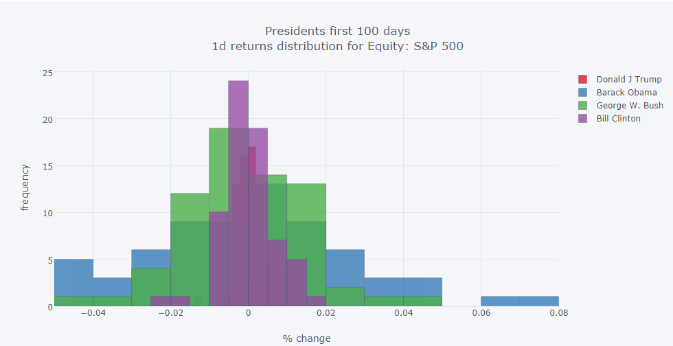

# U.S. Presidents - The first 100 Days


Coined in 1933, the **first 100 days** is sometimes used to measure the successes and accomplishments of a first-term president during the time that the their power and influences are at their greatest.  Approval rates are largely taken from polls and surveys where the results are typically measured based on their performance.  Criteria such as the decisions made, changes based on campaign promises, etc., are expected but also general perception, and overall popularity can be very influential. In addition to public opinion, how the financial markets respond during this time can be an interesting guide or measuring-stick when grading the first 100 days.  

Using the power of Python and the Thomson Reuters Eikon Scripting API, the following article will outline a number of comparisons using a simple Python application to see how the market has responded to the first 100 days.

## <a name="prerequisite"></a>Prerequisites

Software components used:

* [Eikon Web and Scripting API](https://developers.thomsonreuters.com/eikon-apis/eikon-web-and-scripting-apis) - Thomson Reuters interface to access Eikon data on the desktop
* [Python](https://www.python.org/downloads/release/python-361/) (3.6.1)- Python Development Environment - version 3
* [Jupyter notebooks](http://jupyter.org/) - Browser-based development environment to create equations, visualization and explanatory text.
* [ipywidgets](https://github.com/jupyter-widgets/ipywidgets) (6.0.0) - Interactive HTML widgets for jupyter notebooks
  * One time initialization:
    * **With pip**: jupyter nbextension enable --py --sys-prefix widgetsnbextension
    * **With conda**: conda install -c conda-forge ipywidgets 
* [Pandas](http://pandas.pydata.org/) (0.20.3) - Python Data Analysis Library
* [Cufflinks](https://plot.ly/ipython-notebooks/cufflinks/#cufflinks-reference) (0.12.0)  - Library that greatly simplifies [Plotly](https://plot.ly/feed/) charting 

**Note**: This article assumes the user has successfully installed and setup their development/testing environment based on the above requirements.  The links provided outline the details of the components, packages and how to install each.  In addition, we won't be spending time providing basic instructions on the Jupyter Notebook environment and its operation.  It is assumed you have basic familiarity.

## Overview

When measuring the performance of any given president, we can apply multiple scenarios that may be interesting and possibly support approval ratings.  For example, during the first 100 days of President Donald Trump, we can show how the Currency markets responded.  How did the US Dollar and Mexican Peso compare while Trump was in office?  Were the world indices affected differently?  In addition, it would also be interesting to determine how multiple presidents compared to each other.  Did president Obama have any noticeable effect vs president Kennedy?  Using the power of Python's modules to organize and chart complex data sets coupled with Thomson Reuters ability to easily access this historical content, we can find these answers fairly easily.

Let's try out a few scenarios. 

### Setup

Before we begin playing with different scenarios, let's first establish our setup.  As outlined within the [Prerequisite](#prerequisite) section, once a basic environment has been defined, you can grab the application code from the [GitHub repository](https://github.com/TR-API-Samples/Article.EikonAPI.Python.USPresidents).

The application package includes the following:
* **USPresidents_100Days.ipynb**
  
  The Jupiter Notebook document represents the example containing the core Python instructions to execute our application.  All the input data is driven from simple text files allowing the user to easily add additional values.

* **presidents.csv**
  
  The presidents file is a collection of (`name,date`) pairs where the date value represents the inauguration date of their first term:
  ```text
  Donald J Trump, 2017-01-20
  Barack Obama, 2009-01-20 
  George W. Bush, 2001-01-20
  ```

* **industries.csv**

  The industries file contains a collection of (`name,ric`) pairs where the `ric` is the Reuters Instrument Code representing the market of interest:

  ```text
  Equity: Dow Jones, .DJI
  Equity: Mkt Volatility, .VIX
  Currency: USD $, =USD
  ```

## Running the application

The application is executed within the `Jupyter notebooks` web-based environment.
 
  To run the application, let's load up Notebook:

  ```text
  > cd <directory of the downloaded package>
  > jupyter notebook
  ```

Within your browser, load up the `USPresidents_100Days.ipynb` application:


Once loaded, you can start by stepping through the code segments to reach the point where the UI is presented for your input selection.

## Scenario 1 - Donald Trump - Effect on Currencies

According to this [Business Insider article](http://www.businessinsider.com/stock-markets-after-trump-election-2016-12), __prior__ to Trumps inauguration, stocks were on a tear.  During this same timeframe, it was clear how his much publicized rhetoric [triggered Currencies in a big way](http://www.visualcapitalist.com/chart-trump-effect-currencies/).  As we learned from the article referenced above, between Nov 7th 2016 and Jan 5th 2017, the Russian Ruble gained 7.7% against the US Dollar while the Mexican Peso lost 13.4% - supposedly largely due to market reaction to then president elect’s comments on Twitter. Let’s take a look at how these currencies faired against the USD during president Trump’s first 100 days in the office.  

First, select our input parameters from the UI:



Retrieve the raw data:



We see both currencies strengthening against the USD and we see strong correlation between these two currencies. Additionally, we can see the Mexican Peso strongly outperforming the Russian Ruble.



And to support the above comparison, we can utilize Thomson Reuters convenient Cross Rate RICs to measure performance against 2 currencies.  In our case, the instrument **MXN vs RUB** (MXNRUB=R) was chosen which shows the Mexican Peso outperforming the Russian Ruble during this time period.



## Scenario 2 - Comparing multiple presidents against a given market

While using the markets to measure performance of the first hundred days can be an indicator, it certainly isn't the only influence.  Aside from the direct performance of the president during those first hundred days, many uncontrollable external events have had great effect on the economy and market.  For example, some of the presidents over the last century have had to endure such crisis as the Great Depression, the Great Recession, etc. which can significantly skew some indicators.  

The next simple comparison we demonstrated is the comparison of multiple presidents against any given market.  Let's select the last 4 presidents and compare against the S&P 500 index:





The example application also includes some additional views providing a slightly different breakdown of performance:





 ### Next steps

There are a number of articles and papers published over the years discussing the importance of the first 100 days.  It is believed that many Presidents have higher success rates during the first hundred days of their first year than they do later during their first year or during the first hundred days of non-inaugural years.  Feel free to satisfy your own curiosity and explore the many combinations with this simple tool.

## Contributing

Please read [CONTRIBUTING.md](https://gist.github.com/PurpleBooth/b24679402957c63ec426) for details on our code of conduct, and the process for submitting pull requests to us.

## Authors

* **Nick Zincone** - Release 1.0.  *Initial work*

## License

This project is licensed under the MIT License - see the [LICENSE.md](LICENSE.md) file for details

